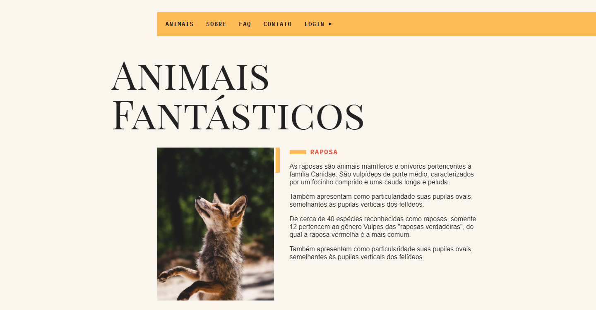

# Animais Fantásticos

## Sobre! 👋

Projeto do curso JavaScript Completo ES6+ da Origamid

---

## Resultado



[CLique aqui para ver o resultado final!](https://wellsantoss.github.io/animais_fantasticos/)

---

## Tecnologias Utilizadas

- HTML5;
- CSS3/SASS;
- JavaScript.

---

## Instalação

Você precisará de um servidor para rodar o projeto, recomendo a extensão Live Server no Visual Studio Code.

```
# Clone o repositório
$ git clone https://github.com/WellSantoss/animais_fantasticos.git

# Entre na pasta do repositório
$ cd animais_fantasticos

# Instale as dependências
$ npm install

# Rode em modo de desenvolvimento
$ npm run dev
```
